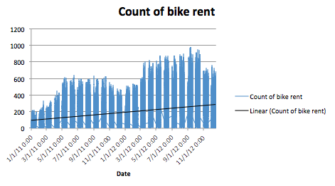
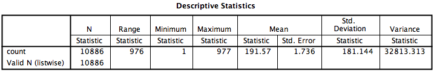
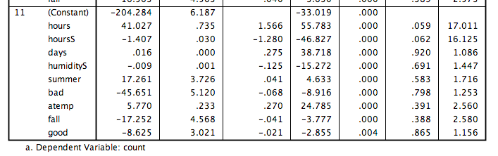

# Bike Sharing Demand
## Introduction
In this analysis the demand of bikes is predicted.
First the interpretation of the problem is stated, then the data is explored, first by looking at the data qualitatively and then quantitatively with some exploratory analyses. Out out these explorations assumptions of the behaviour are made.
Thereafter the prediction is performed. Also the different methods and tools used are explained. The results will be evaluated and recommendations for future work are given.

##Problem definition
"Bike sharing systems are a means of renting bicycles where the process of obtaining membership, rental, and bike return is automated via a network of kiosk locations throughout a city. Using these systems, people are able rent a bike from a one location and return it to a different place on an as-needed basis." [[Kaggle](https://www.kaggle.com/c/bike-sharing-demand). 
By predicting the demand of bicycles, the allocation of resources can be optimized.

Hourly rental data is provided with weather information. The data span 2011 to 2013. The train data consists of the first 19 days and the test data the rest of the month.

## Exploration
### Qualitative exploration
The dataset contains the following attributes:

####Predictors

|Attribute | Data level | Description|
---|---|---|
|datetime | Timestamp | Used to determine behaviour over time |
|season | Nominal | In the summer and spring probably more bicycles rent |
|holiday | Dichotomous | When holiday is true probably more bicycles are rented |
|workingday | Dichotomous | In cities where the bikes are used for leisure less bikes are rent during working days, when mainly used by e.g. commuters, probably more bikes are used during working days |
|weather | Ordinal | When the weather is better (1=best, 2=wost) more bikes are rent |
|temp | Interval | Temp probably results in multicollinearity with atemp since they measure practically the same |
|atemp | Interval | Atemp is probably then a better predictor, since this has more influence on customers' behaviour |
|humidity | Ratio | Probably the less humid more bikes are rent |
|windspeed | Ratio | Probably the less windy more bikes are rent |


####Dependent attributes

|Attribute | Data level | Description|
|---|---|---|
|casual | Ratio |  number of non-registered user rentals initiated
|registered | Ratio | number of registered user rentals initiated
|count | Ratio | This is the number of bikes rent, the attribute that has to be predicted (the sum of casual and registered users)

Taking a look at the graph date vs. count, it can be seen that: the demand of bikes has a bit of a sinus behaviour, probably due to seasons, and the demand increases over time. (Or the weather conditions have changed significantly in two years, which, after checking, appears not the case) 



### Exploration with SPSS
To look at the behaviour of the data in relation to the count of bike rentals I used SPSS since it provides clear tables and descriptives.

A first glance at the count shows the following basics:


```sh

DESCRIPTIVES VARIABLES=count
  /STATISTICS=MEAN STDDEV VARIANCE RANGE MIN MAX SEMEAN.
```

I used further exploration to see in what way the attributes affect the bike count.

```sh
EXAMINE VARIABLES=count BY season
  /PLOT BOXPLOT STEMLEAF HISTOGRAM
  /COMPARE GROUPS
  /STATISTICS DESCRIPTIVES EXTREME
  /CINTERVAL 95
  /MISSING LISTWISE
  /NOTOTAL.
```

This roughly shows for example the seasonal change in bike demand and the correlation with the weather as explained in the previous section.
To examine the relevance of the attributes (the interval and ratio and the dichotomous attributes, see the table above) I started off with a simple linear regression.
This also gave insight in, for example the multicollinearity of 'temp' and 'atemp'. This means that they pretty much measure the same behaviour. As assumed in the table above 'atemp' is significantly a better predictor than 'temp'.

After determining the coefficients I used excel for calculating the predicted counts and the RMSLE. For testing the model I randomly picked a subset of train.csv: 67% training data and 33% testing data.

```sh
DATASET ACTIVATE DataSet4.
REGRESSION
  /MISSING LISTWISE
  /STATISTICS COEFF OUTS R ANOVA COLLIN TOL
  /CRITERIA=PIN(.05) POUT(.10)
  /NOORIGIN 
  /DEPENDENT count
  /METHOD=STEPWISE atemp humidity windspeed days hours atempS humidityS windspeedS daysS hoursS 
    spring summer fall winter better good bad worse.
```
I only included the dichotomous (dummy variables), interval and ratio attributes. The nominal attributes are split by indicator coding into: summer, winter, spring and fall, and better, good, bad and worse for season and weather respectively.
For simplicity I took the date as hours from the start of the dataset. Also I included hour of the day which is attribute 'hours'. I am aware of its cyclic behaviour but for now I took it as a (curve)linear relation.
For example 'hour of the day' has no linear relation. Therefore I tested all the attributes on curvilinearity addid a squared attribute.



This Model 11 shows all significant attributes. Those coefficients are used to calculate the predicted count of bike demand. 

This rough estimation gave already a Root Mean Squared Logarithmic Error (RMSLE) of 1.31.

### First conclusions
After some data preparation like correcting for nominal and cyclical attributes and taking e.g. the increase of demand into account their can be already said quite something about the bike demand. However, there is still a lot room for improvement.
I used only a simple linear regression model (with curvilinear attributes). More advanced models like random forest, a very popular algorithm in predictions, can be deployed to improve the predictions and decrease the RMSLE. There may be more relations I did not find with these exploration. Some interaction effects or other effect that are not caused by weather but does significantly affect the bike demand. For example coupons that are issued during the year, a peak of tourists visiting the city, or some kind of 'happy hours'. Also I could define the attributes more fine grained and determine an early friday rushhour or lunch times etc.

In the next part I'll improve the predictions.


## Using Random Forest
For the Random Forest model I used R, because there are relatively simple packages to deploy RF algorithms.
I used the Random Forest algorithm for regression. The random forest automatically balances between the bias and variance (by averaging the decision trees) resulting in an optimal regression model (almost) without overfitting. 
I tested whether the Random Forest was suited for the bike demand dataset by cross validating. 
In the code below, the implementation of the Random Forest algorithm as well as the cross validation of the RF is explained.
The R file can also be found in [this file](BikeSharingPrediction.R).

```splus
#Settings
##set working directory on my local computer. Change this to the path where your script is located
setwd("/Users/jeroenvos/Dropbox/1 Private/GITHUB/BikeSharingDemand")

## clear workspace
rm(list=ls())

## Load libraries
### install package by running install.packages("randomForest")
library(randomForest)
#set seed in case of random number that are used
set.seed(123)

#Load Kaggle datasets
traindata <- read.csv("data/train.csv", header=TRUE, sep = ",")
testdata <- read.csv("data/test.csv", header = TRUE, sep = ",")

#load the data (with extended attributes) that is already is cleaned for the linear regression
extdata <- read.csv("data/exttrain.csv", header=TRUE, sep = ",")
exttestdata <- read.csv("data/exttest.csv", header=TRUE, sep = ",")


#Create a random Forest model
fit <- randomForest(count ~ holiday + workingday + temp + atemp + humidity + windspeed + hours + hoursS + spring + summer + fall + winter + better + good + bad + worse, data=extdata)
#make predictions based on 'fit'
pred <- predict(fit, exttestdata)

# validate the models (from example: http://www.inside-r.org/packages/cran/randomForest/docs/rfcv)
## make a attributes data frame
attributes <- data.frame(extdata$holiday, extdata$workingday, extdata$temp, extdata$atemp, extdata$humidity, extdata$windspeed, extdata$days, extdata$hours, extdata$hoursS, extdata$spring, extdata$summer, extdata$fall, extdata$winter, extdata$better, extdata$good, extdata$bad, extdata$worse)
## Set up random forest cross validation
result <- replicate(5, rfcv(attributes, extdata$count), simplify=FALSE)
error.cv <- sapply(result, "[[", "error.cv")
matplot(result[[1]]$n.var, cbind(rowMeans(error.cv), error.cv), type="l",
        lwd=c(2, rep(1, ncol(error.cv))), col=1, lty=1, log="x",
        xlab="Number of variables", ylab="CV Error")
# This validation returns the MSE instead of RMSLE 
## ** running the validation takes a lot of time**


#Write predictions to the submission file
preddata <- data.frame(testdata[,1], round(pred,0), stringsAsFactors=FALSE)
colnames(preddata)<- c("datetime","count")
write.csv(preddata, "data/submission.csv", row.names=FALSE, quote=FALSE)


```


Submitting the results to Kaggle shows a RMSLE of: 0.50620


## Future work
* More models/ algorithms  can be tested and evaluated.
* I can optimize the sparsity by experiment with the different attributes used in the random forest model.
* I can elaborate more on the relations within e.g. dates and time. 
* Now I only used the default random forest class. I could experiment with different variables.
* Because 'casual' and 'registered' are included I maybe could predict them separately. However, for now I am not sure how to use this properly in my models.
* To better communicate the analyses and results I should perform everything in just one environment e.g. in R.


